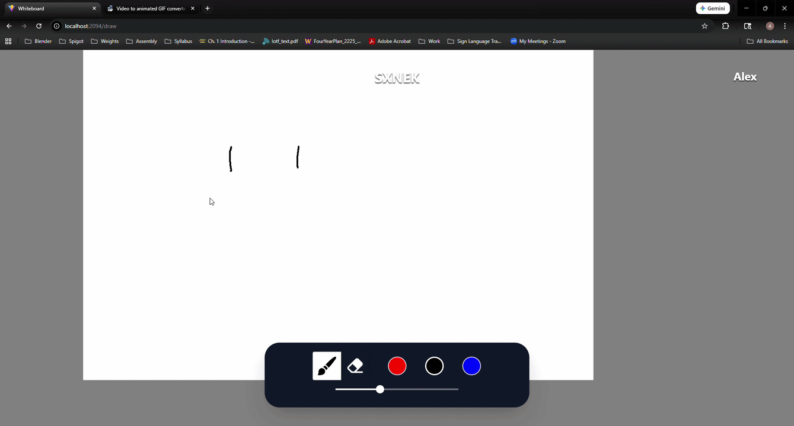
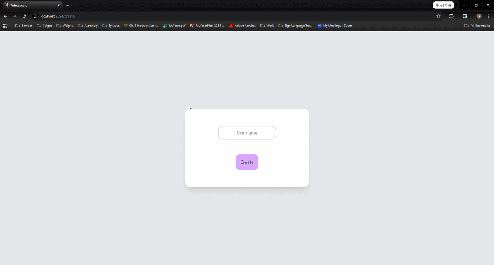
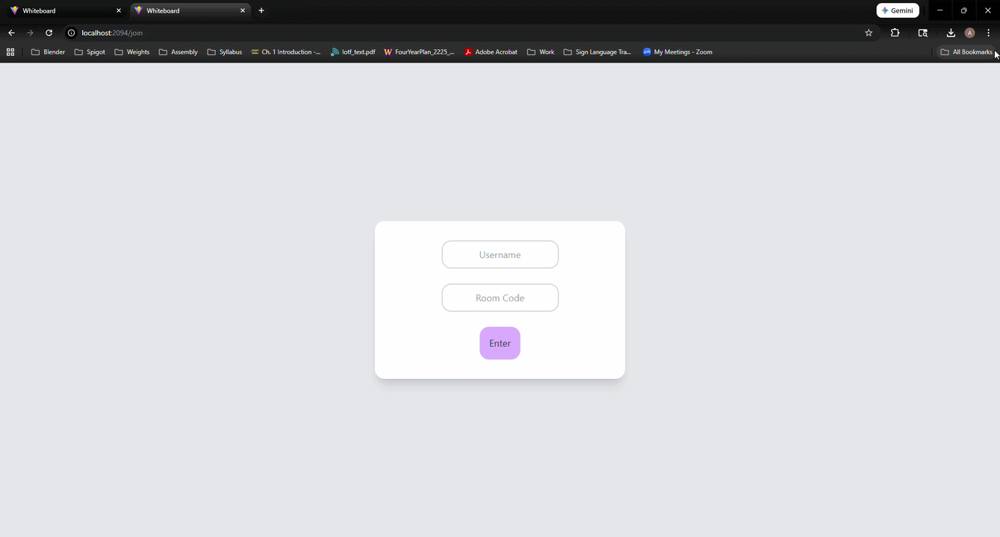

# Whiteboard

Whiteboard is a website where users can draw anything on a virtual whiteboard!

* Join and create private rooms!
* Draw with three colors: black, red, and blue.
* Draw to your heart's desire!

## Creating a room
* Start server
* Go to localhost:2094/create
* Enter your username and click join

## Joining a room
* Got to localhost:2094/join
* Get room code from your friend
* Enter your username and room code
* Click join

## Stack
For the frontend, we are using the React Framework along with several libraries such as Konva and Materia UI. 

For the backend, we are using Express.js along with Socket.io for realtime communication between different users.

Finally, we are using PostgreSQL to store data room information and line data.

## Database

## Images

This project utilizes two Docker images: a Node.js base image for both the frontend and backend, and a PostgreSQL base image for the database.
