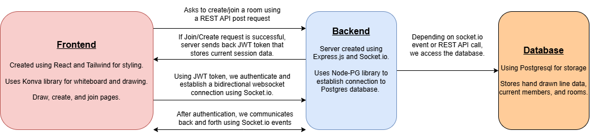
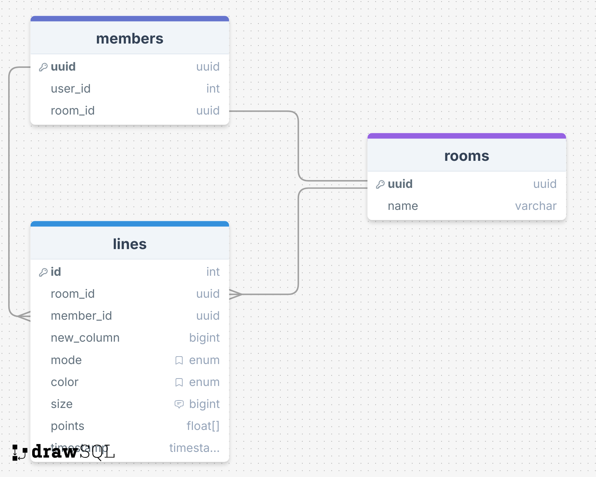

# Whiteboard 
A website where users are able to create a virtual whiteboard for others to join and draw on. 

## Diagram

## Database

## Images 
This project utilizes two Docker images: a Node.js base image for both the frontend and backend, and a PostgreSQL base image for the database.
