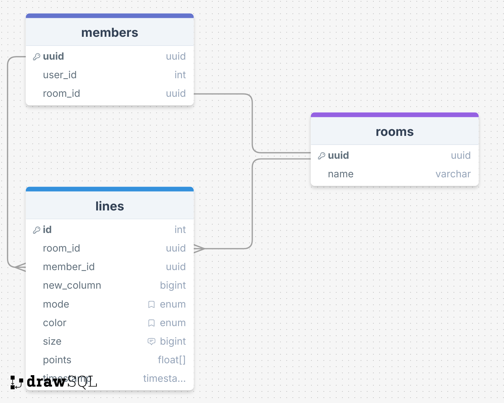

# Whiteboard

Whiteboard is a website where users can draw anything on a virtual whiteboard!

- Join and create private rooms!
- Draw with three colors: black, red, and blue.
- Draw to your heart's desire!


## Creating a room

- Start server
- Go to localhost:2094/create
- Enter your username and click join


## Joining a room

- Got to localhost:2094/join
- Get room code from your friend
- Enter your username and room code
- Click join


## Stack Overview

For the frontend, we use the React Framework with several libraries such as Konva for Canvas and drawing functionality, and Materia UI for additional UI elements. The frontend communicates with the backend server using HTTP requests and Socket.io events.

For the backend, we use Express.js to handle HTTP requests and Socket.io for realtime communication between different clients nad the server. We are also using node-postgres to establish a Postgres client, allowing our backend server to communicate with our Postgres database. Then finally, we use other libraries such as Bcrypt to hash passwords and jsonwebtoken for JWT implemention.

Finally, we are using PostgreSQL to store user data such as user information (usernames and hashed passwords), along with whiteboard data (rooms, lines, members, etc).


## Backend

### HTTP
We use HTTP requests to handle user authorization/authentication (login, registration, token refreshs) and some Whiteboard functionality, specifically creating new rooms.

There are two routes: /auth and /api.

Auth Route:
* /login: Authenticates the user and sends an access and a refresh token.   
* /register: Creates a new user and sends an access and a refresh token.   
* /refresh: Verifies the refresh token and sends a new access token.

Api Route
* /create: Creates a new room and sends the room code to the client. 

## Socket.io
We use Socket.io events to handle real-time functionality in the Whiteboard room. This includes adding new lines, updating the current members list, joining rooms, etc. These events are divided among the canvas, member, and room handler. 

Room Handler Events: 
* join_room: Adds user to a room with the given room code. If the user is successfully added to a room, the room/member information is attached to the socket connection, the members list is updated for all clients in the room, and the canvas and member data is sent back to the client via an acknowledgement.
* leave_room: User is removed from the room. Then, if the current room is empty for 5 seconds, then the room itself is deleted. 

Canvas Handler Events:
* get_canvas: Retrieves the current canvas from the database and sends it to the client.
* add_line: Add new line to the users in the clients's room. 

Member Handler Events: 
* update_members: Sends back the updated list of all members in the client's room. 

## Authentication


## Database



## Images

This project utilizes two Docker images: a Node.js base image for both the frontend and backend, and a PostgreSQL base image for the database.

### Backend

```
FROM node:22.13.1 # Uses Node.js base image

WORKDIR /app # Set working directory to the app directory
COPY package*.json . # Copy package.json and package-lock.json into app directory of the container

RUN npm install # Install all dependencies using package.json
COPY . . # Copy all code and files (except those in .dockerignore) into working directory
EXPOSE 3000 # Exposes port 3000

CMD ["npm", "run", "start"] # On docker run, run the backend server
```

I chose the Node base image because my backend is a Node.js application.

### Frontend

```
FROM node:22.13.0 # Uses Node.js base image

WORKDIR /app # Set working directory to the app directory

ARG NODE_ENV # Create argument for the current environment: Production and Dev
ARG VITE_SERVER_PORT # Create argument for the port for the frontend server

ENV NODE_ENV = ${NODE_ENV} # Set NODE_ENV environment variable to argument variable
ENV VITE_SERVER_PORT=${VITE_SERVER_PORT} # Set NODE_ENV environment variable to argument variable

COPY package*.json . # Copy package.json and package-lock.json into app directory of the container

RUN npm install --legacy-peer-deps # Installs all dependencies using package.json (including legacy dependencies)
COPY . . # Copy all code and files (except those in .dockerignore) into working directory
EXPOSE 2094 # Expose port 2094
RUN npm run build # Builds the server

CMD ["npm", "run", "preview"] # On docker run, run the frontend server
```

I chose the Node base image for my frontend because my frontend is a Vite React App.

## Networking

The PostgreSQL database server is accessible to every service in stack using DNS resolution by container name.

The frontend and the backend are both exposed to the internet. So, the frontend is able to communicate with the backend using HTTP requests and socket events.
