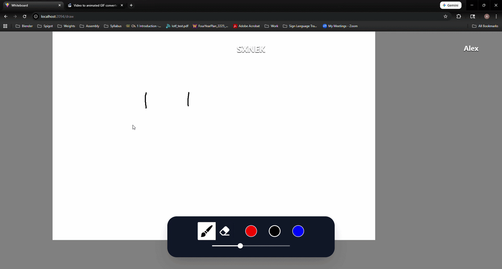
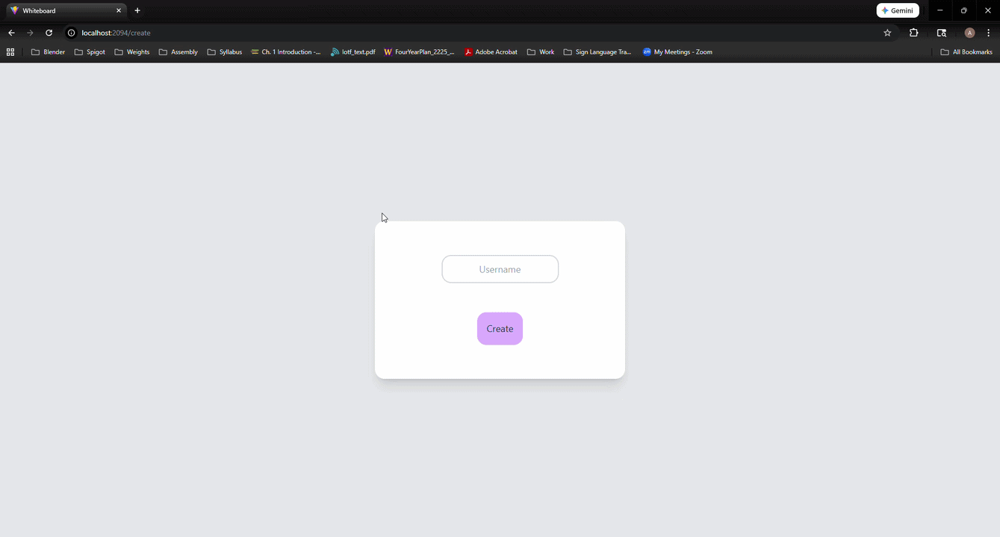
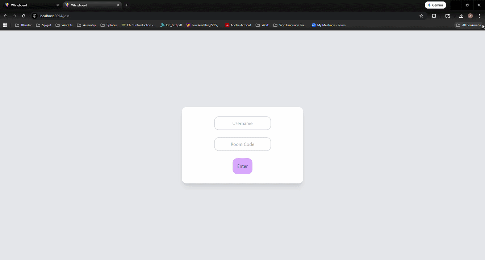
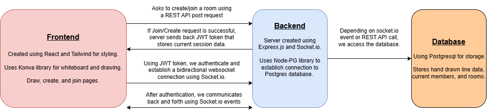
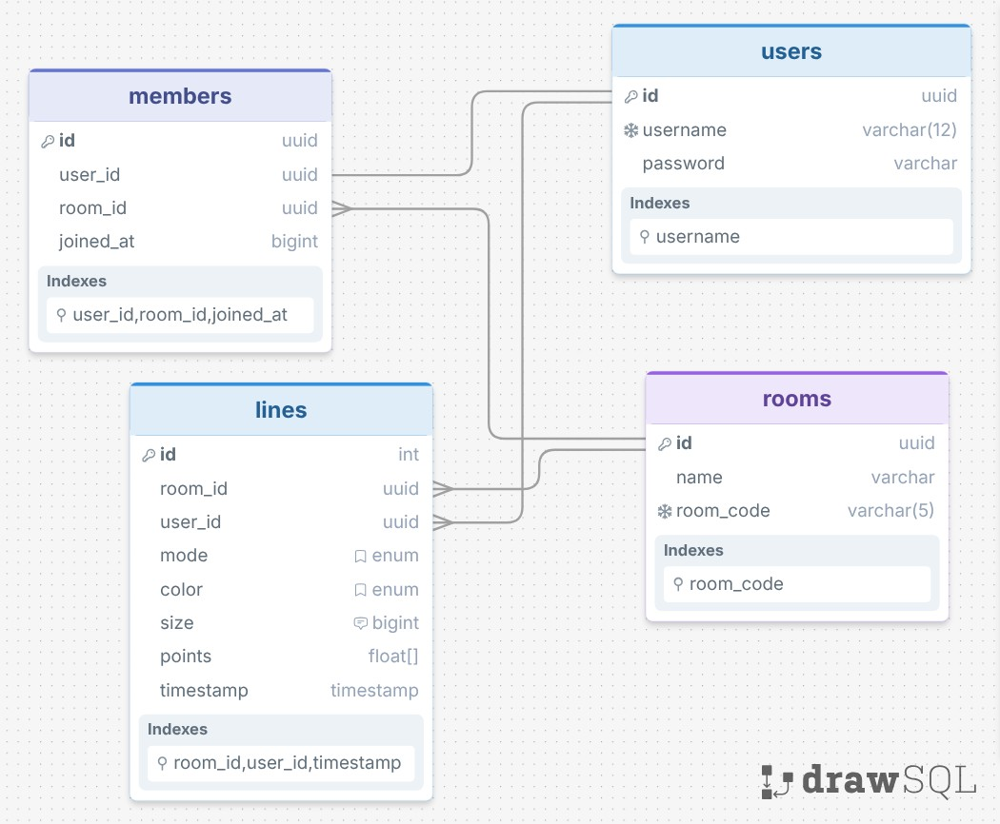

# Whiteboard

Whiteboard is a website where users can draw anything on a virtual whiteboard!

- Join and create private rooms!
- Draw with three colors: black, red, and blue.
- Draw to your heart's desire!



## Creating a room

- Start server
- Go to localhost:2094/create
- Enter your username and click join



## Joining a room

- Got to localhost:2094/join
- Get room code from your friend
- Enter your username and room code
- Click join



## Stack Overview

For the frontend, we use the React Framework with several libraries such as Konva for Canvas and drawing functionality, and Materia UI for additional UI elements. The frontend communicates with the backend server using HTTP requests (specifically using the Axios library) and Socket.io events.

For the backend, we use Express.js to handle HTTP requests and Socket.io for realtime communication between different clients nad the server. We are also using node-postgres to establish a Postgres client, allowing our backend server to communicate with our Postgres database. Then finally, we use other libraries such as Bcrypt to hash passwords and jsonwebtoken for JWT implemention.

We use PostgreSQL to store user data such as user information (usernames and hashed passwords), along with whiteboard data (rooms, lines, members, etc).

Finally, we use NGINX to act as a reverse proxy as well as handle load balancing and rate-limiting.



## Backend

### HTTP

To handle user authorization/authentication (login, registration, token refreshs) and some Whiteboard functionality, specifically creating new rooms, clients can send HTTP requests to the backend.

There are two main routes: /auth and /api.

Auth Route:

- /login: Authenticates the user and sends an access and a refresh token.
- /register: Creates a new user and sends an access and a refresh token.
- /refresh: Verifies the refresh token and sends a new access token.

Api Route

- /create: Creates a new room and sends the room code to the client.

### Socket.io

We use Socket.io events to handle real-time functionality in the Whiteboard room. This includes adding new lines, updating the current members list, joining rooms, etc. These events are divided among the canvas, member, and room handler.

Room Handler Events:

- join_room: Adds user to a room with the given room code. If the user is successfully added to a room, the room/member information is attached to the socket connection, the members list is updated for all clients in the room, and the canvas and member data is sent back to the client via an acknowledgement.
- leave_room: User is removed from the room. Then, if the current room is empty for 5 seconds, the room is deleted.

Canvas Handler Events:

- get_canvas: Retrieves the current canvas from the database and sends it to the client.
- add_line: Add new line to the users in the clients's room.

Member Handler Events:

- update_members: Sends back the updated list of all members in the client's room.

### Middleware

We authenticate both socket connections and requests sent to the API endpoints using the following authentication processes.

Socket.io Authentication:

- Checks if there exists an access token inside of socket.handshake.auth object.
- Verifies the sent token using the JWT secret.
- Ensures that there is a username and user_id field attached to the token.
- Attaches username and user_id to socket connection.
- If any of the previous steps fails, stop the socket connection and send a connection error to the client.

REST API Authentication:

- Checks if there is a bearer token in the authorization header of the request.
- Verifies the bearer token using the JWT secret.
- Ensures that there is a username and user_id field attached to the token.
- If any of the pervious steps fails, send a response with a 401 status.

### Backend Image

```dockerfile
FROM node:22.13.1 # Uses Node.js base image

WORKDIR /app # Set working directory to the app directory
COPY package*.json . # Copy package.json and package-lock.json into app directory of the container

RUN npm install # Install all dependencies using package.json
COPY . . # Copy all code and files (except those in .dockerignore) into working directory
EXPOSE 3000 # Exposes port 3000

CMD ["npm", "run", "start"] # On docker run, run the backend server
```

I chose the Node base image because my backend is a Node.js application.

## Frontend

### Auth Context

The Auth Context contains necessary states and functions needed for user authentication and authorization.

States:

- accessToken: Contains the access token for the client.

Functions:

- login: Sends a POST request to /auth/login with new username and password details. If the request was successful, we set the access token state to the token retrieved from the backend.
- register: Sends a POST request to /auth/register with the username and password details. If the request was successful, we create a new user in our database and set the access token state to the token retrieved from the backend.
- refreshToken: Verifies if the refresh token is still valid and returns a new access token if it is.

### Refresh Handler

If either an HTTP requests fails or a socket connection fails, we try to refresh the access token using Axios request/response interceptors and connect_error event respectively.

### Room Context

The Room Context contains necessary states and functions needed for managing room behavior.  

States:

- roomCode: Stores the current code of the room.
- roomJoined: Flag that shows if the current user is currently in a room.
- lines: Contains all drawn lines in the room
- users: Contains the list of current users in the room.

Functions:

- createRoom: Sends a POST request to /api/create to create a new room and return its room code. If request is successful, set roomCode state to the code sent.  
- joinRoom: Sends a join_room event and on success, initializes all room state variables (lines, users, roomCode, etc.) and navigate to whiteboard page.
- leaveRoom: Clears all room states and navigate to either the create or login page.

### Frontend Image

```dockerfile
FROM node:22.13.0-alpine AS builder

# Stage 1: Building React Application
WORKDIR /app

ARG BACKEND_URL
ARG BACKEND_PORT

ENV VITE_BACKEND_URL=${BACKEND_URL}
ENV VITE_BACKEND_PORT=${BACKEND_PORT}

COPY package*.json .

RUN --mount=type=cache,target=/root/.npm npm install --legacy-peer-deps

COPY . . 

RUN npm run build

# Stage 2: Running React Application
FROM node:22.13.0 AS runner

# Set the working directory inside the container
WORKDIR /app
  
# Copy only the production build output from the builder stage
COPY --link --from=builder /app/dist ./dist
 
# Install only the `serve` package (no global install, pinned version)
RUN --mount=type=cache,target=/root/.npm npm install serve@^14.2.6 --omit=dev
 
# Run `serve` directly to serve the built app
CMD ["sh", "-c", "./node_modules/.bin/serve -s dist -l tcp://0.0.0.0:${FRONTEND_PORT}"]

```

I chose the Node base image for my frontend because my frontend is a Vite React App.

## Database

We use the following schema for our database model.



## Authentication

For authentication, users require both a JWT refresh and access token.

Refresh token: Long-lived token (7 days) that allows us to refresh our access token using the /auth/refresh endpoint.
Access token: Short-lived token (15 minutes) that grants us permission to access resources (establish a websocket connection and access /api route).

## Networking

The PostgreSQL database server is accessible to every service in stack using DNS resolution by container name.

The frontend and the backend are both exposed to the internet. So, the frontend is able to communicate with the backend using HTTP requests and socket events.
